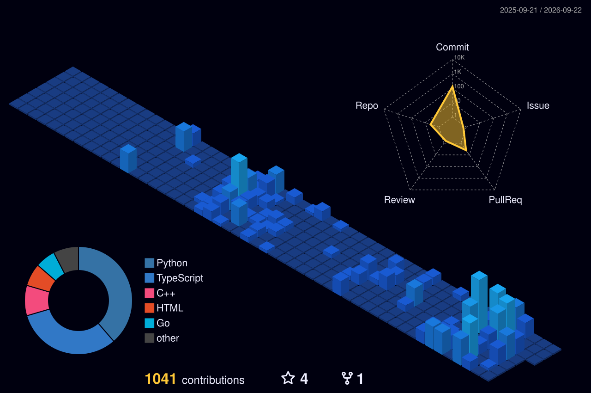

  <video src="https://github.com/user-attachments/assets/00f6e8af-e636-4fd6-81ff-c201a7f59c17" width="800" autoplay loop muted playsinline></video>

# Hello, I'm Franklin Soares 

**Software & Automation Engineer | Bridging Low-Level Logic & High-Level Interfaces**

\_Coding the future beyond the horizon.\_

---

### About Me

With a degree in **Science & Technology** and currently pursuing **Computer Engineering** at **UFRN**, I specialize in bridging the gap between industrial automation and modern web systems.

As a co-founder and lead developer of **SpeedMasters**, I have experience building robust, full-stack ecosystems—from racing management platforms to complex 3D modeling tools. My core focus is on precision, scalability, and high-performance architecture.

- Based in Natal, RN, Brazil.
- Lead Dev @ [Speedmasters.com.br](https://speedmasters.com.br).
- Explore my full portfolio: **[franssoares.netlify.app](https://franssoares.netlify.app)**

---

### 💻 Tech Stack

**Working with**

  
  
  
  
  
  
  
  

**Currently Learning:**

  
  
  

---

### GitHub Contributions

  

---

### Let's Connect

  
  
  

